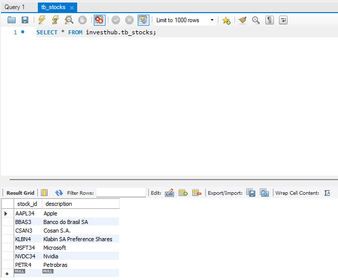

# InvestHub - Agregador de Investimentos

O InvestHub é uma aplicação backend desenvolvida com Spring Boot, que tem como objetivo gerenciar informações de ativos financeiros de forma organizada, possibilitando operações como cadastro de ações, consulta de cotações e gerenciamento de carteiras de investimento.

Além de oferecer um CRUD completo para ativos, o projeto integra a API pública da Brapi para buscar cotações atualizadas de ações e fundos listados na bolsa de valores brasileira, simulando um sistema real de investimentos. Foi desenvolvido aplicando conceitos avançados de desenvolvimento Java, como testes unitários, consumo de APIs externas e boas práticas de organização de projetos.

## ✨ Principais objetivos

- Praticar a construção de APIs RESTful com Spring Boot

- Integrar consumo de APIs externas (Brapi) em um projeto real

- Criar testes unitários para garantir a qualidade do código

- Organizar o projeto utilizando arquitetura limpa, DTOs e serviços

- Simular um sistema real de gerenciamento de investimentos

## 🚀 Tecnologias Utilizadas

- ✅ Java 21 – linguagem principal do projeto.
- ✅ Spring Boot – framework para construção da API REST.
- ✅ Spring Data JPA – persistência de dados e integração com o banco.
- ✅ Spring Cloud OpenFeign – client HTTP para consumo de APIs externas.
- ✅ H2 Database – banco em memória utilizado nos testes.
- ✅ MySQL – banco de dados relacional utilizado.
- ✅ JUnit 5 – criação de testes unitários.
- ✅ Mockito – mock de dependências nos testes.
- ✅ API Brapi – consumo de dados de ações e fundos em tempo real.
- ✅ Maven – gerenciamento de dependências e build do projeto.
- ✅ Postman – teste e documentação dos endpoints da API.

## ✅ Exemplo de Requisição Realizada no Postman


## ✅ Exemplo de retorno de cotação pela integração com a Brapi


## ✅ Exemplo do Banco de Dados MySQL


## Como Rodar o Projeto

### ⚙️ Pré-requisitos

- [MySQL](https://dev.mysql.com/downloads/) instalado.
- Token da [Brapi](https://brapi.dev/?linkId=lp_334200&sourceId=buildrun&tenantId=brapi) gerado.

### 📝 Passo a passo

1. **Baixe e instale o MySQL**

   Caso ainda não tenha instalado, baixe em [MySQL Downloads](https://dev.mysql.com/downloads/).

2. **Crie o banco de dados no MySQL**

   ```sql
   CREATE DATABASE investhub;

3. **Faça um cadastro no [Site da Brapi](https://brapi.dev/?linkId=lp_334200&sourceId=buildrun&tenantId=brapi) e crie um token para consumir a API.** 

4. **Configure a variável de ambiente do token**

- Na sua IDE ou no sistema, crie uma variável de ambiente chamada TOKEN.
- Cole o token gerado como valor.

5. **Execute o projeto como aplicação Spring Boot**

Na IDE, clique para rodar como Spring Boot Application ou utilize o comando abaixo no terminal:
```bash
./mvnw spring-boot:run
```
6. **Use o Postman para testar os endpoints manualmente**

7. **Verifique os dados no MySQL**

- Conecte no banco de dados investhub e visualize os dados inseridos pelas requisições realizadas.


<br><br>

## 🙋 Sobre o Autor


Desenvolvido por Jefferson Sousa  
[GitHub](https://github.com/JeffSSousa) | [LinkedIn](https://www.linkedin.com/in/jefferson-sousa-8b93a81a2/)